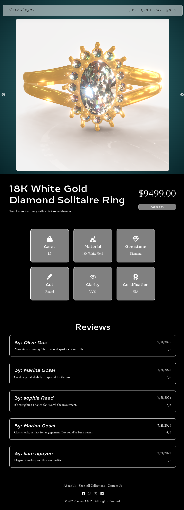

# Velmoré & Co - a high-end jewelry eCommerce web page

this project is work in progress.
using .NET as back-end, with ASP.NET Core web API to make RESTful APIs.
using React for front end, React router v7 is used for page routing.
using React three fiber (R3F) to show jewelry 3D models in browser.

---
